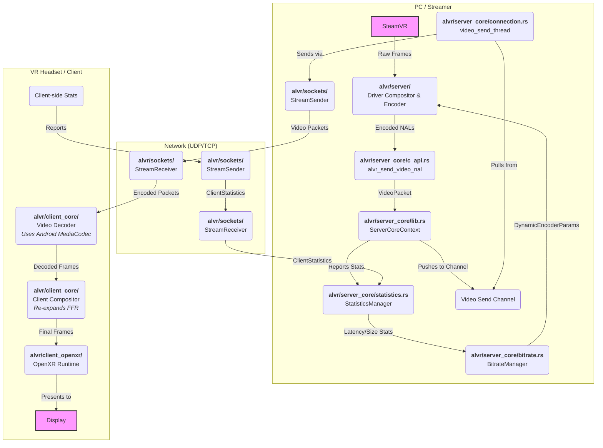

# Understanding ALVR

## Architecture

### System Diagram

```mermaid
graph TD
    subgraph "PC / Streamer"
        A[SteamVR] -- Raw Frames --> B(<b>alvr/server/</b><br>Driver Compositor & Encoder);
        B -- Encoded NALs --> C(<b>alvr/server_core/c_api.rs</b><br>alvr_send_video_nal);
        C -- VideoPacket --> D(<b>alvr/server_core/lib.rs</b><br>ServerCoreContext);
        D -- Reports Stats --> E(<b>alvr/server_core/statistics.rs</b><br>StatisticsManager);
        D -- Pushes to Channel --> F(Video Send Channel);
        G(<b>alvr/server_core/connection.rs</b><br>video_send_thread) -- Pulls from --> F;
        G -- Sends via --> H(<b>alvr/sockets/</b><br>StreamSender);

        I(<b>alvr/server_core/bitrate.rs</b><br>BitrateManager) -- DynamicEncoderParams --> B;
        E -- Latency/Size Stats --> I;
    end

    subgraph "Network (UDP/TCP)"
        H -- Video Packets --> J(<b>alvr/sockets/</b><br>StreamReceiver);
        K(<b>alvr/sockets/</b><br>StreamSender) -- ClientStatistics --> L(<b>alvr/sockets/</b><br>StreamReceiver);
    end

    subgraph "VR Headset / Client"
        J -- Encoded Packets --> M(<b>alvr/client_core/</b><br>Video Decoder<br><i>Uses Android MediaCodec</i>);
        M -- Decoded Frames --> N(<b>alvr/client_core/</b><br>Client Compositor<br><i>Re-expands FFR</i>);
        N -- Final Frames --> O(<b>alvr/client_openxr/</b><br>OpenXR Runtime);
        O -- Presents to --> P[Display];

        Q(Client-side Stats) -- Reports --> K;
        L -- ClientStatistics --> E;
    end

    style A fill:#f9f,stroke:#333,stroke-width:2px
    style P fill:#f9f,stroke:#333,stroke-width:2px
```
