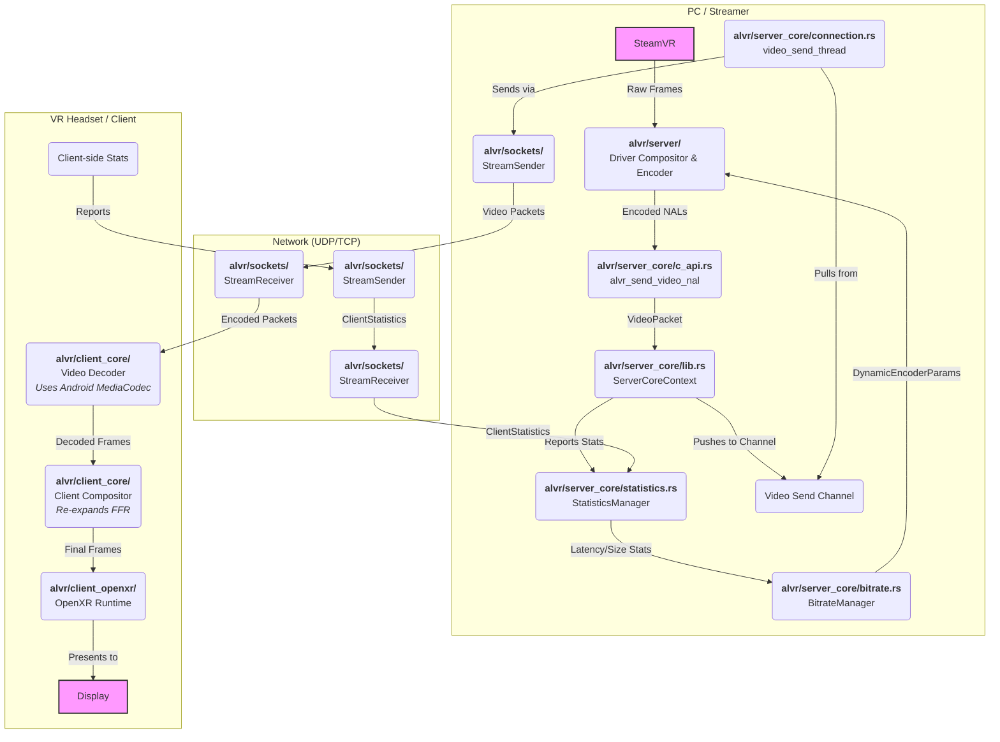
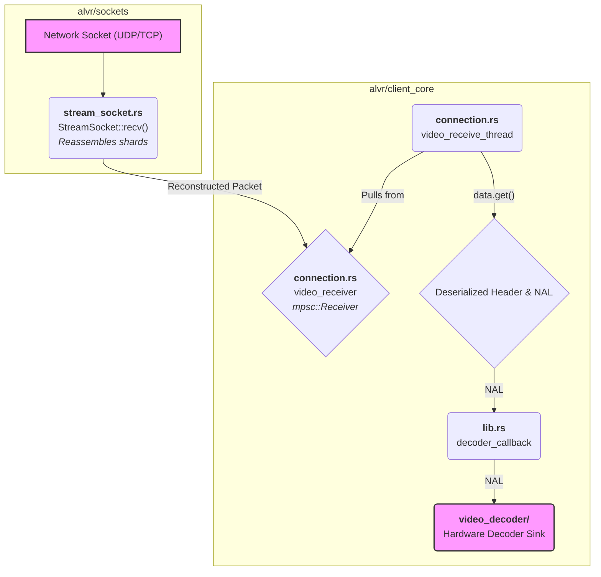
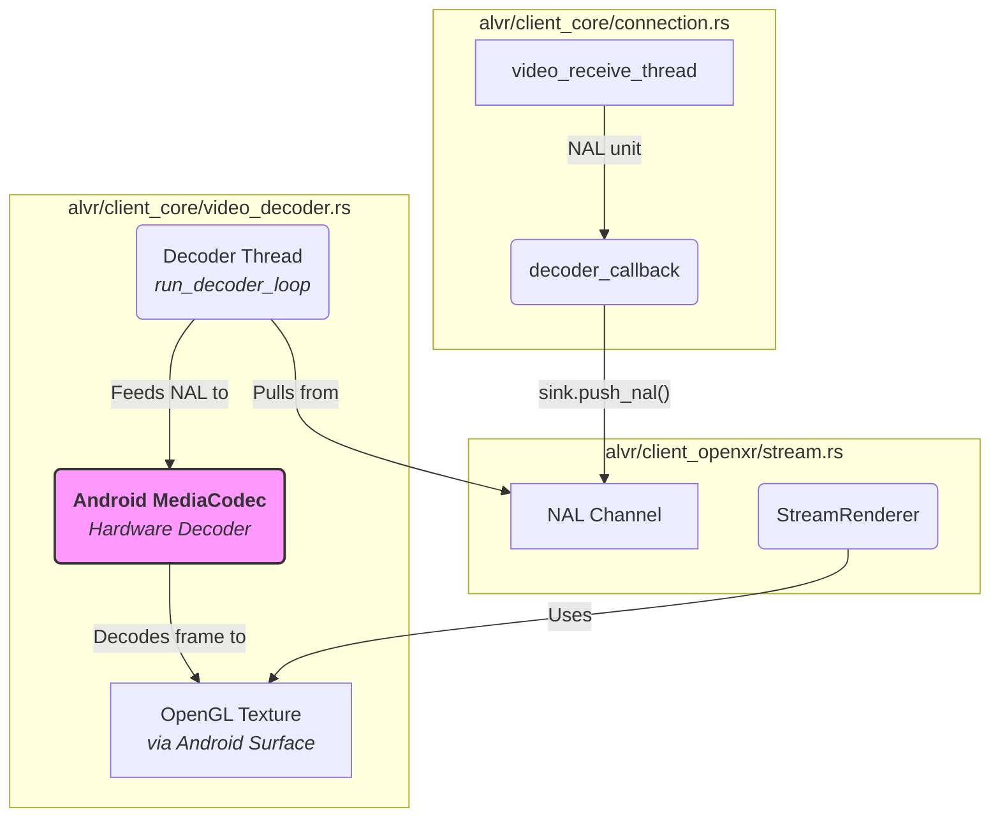

# Understanding ALVR

## System Diagram

### Overall Architecture

### Server

`TODO`

### Client

**Network**

**Video Decoding**

# Vocabulary

## Video

- **Network Abstraction Layer (NAL)**: A logical packet within a video stream in H.264 (AVC) and H.265 (HEVC) video compression standards. It has several types, including **parameter sets** (SPS/PPS) that contains metadata including resolution, frame rate, and encoding profile, **IDR frames**, which are self-contained frame that does not depend on any previous frames (used for re-syncing after frame drop), and other types of frames. 

## Network

## Rust
- **Atomically Reference Counted (`Arc`)**: An Arc in Rust is a thread-safe, reference-counted smart pointer. An `Arc<T>` wraps your data of type `T` and keeps track of how many active references (or "owners") point to it. The "atomic" part is crucial: it guarantees that the incrementing and decrementing of the count is a safe operation that won't be corrupted even when multiple threads are doing it at the same time.
  1. **Creation**: You create an `Arc` with `Arc::new(data)`. At this point, the reference count is 1.
  2. **Cloning**: When you want to share ownership, you call Arc::clone(&my_arc). This doesn't clone the data itself; it just creates a new pointer to the same data and atomically increments the reference count by one. This cloning is very cheap.
  3. **Dropping**: When an `Arc` goes out of scope, its destructor atomically decrements the reference count.
  4. **Deallocation**: The actual data on the heap is only deallocated and cleaned up when the reference count drops to zero, meaning the last owner has gone out of scope.

